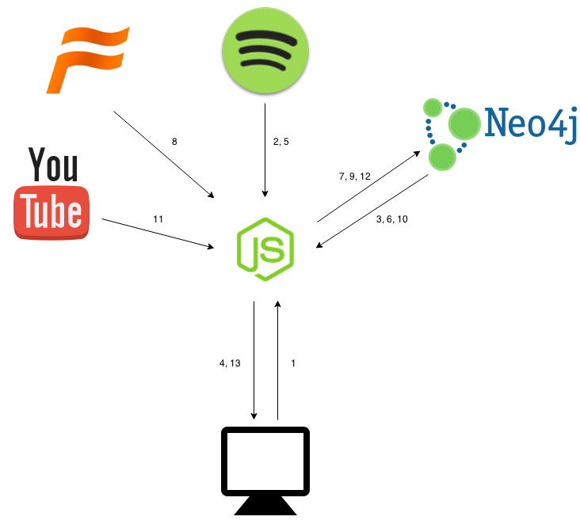

# MuVi
## Inledning
Jag har valt att göra en spelare av musikvideor. Detta gör jag genom att hämta en användares
spellistor från Spotify och göra en sökning på youtube för varje låt. För att få så bra träffar som
möjligt slår jag först upp artisten på Freebase och gör sökningen med deras mid. Detta är möjligt
tack vare att Google har taggat upp stora delar av musikvideorna på Youtube mot Freebase.

Min arbetsgång var först att få backenden klar i ett sådant skick att jag kunde arbeta obehindrat
på klienten. Detat gjorde jag genom att först sätta upp databas och börja hämta data från Spotify,
Freebase och Youtube. Efter det har jag arbetat ganska fritt och gjort det som kännts viktigast för
stunden.

Jag har inte sett några liknande applikationer vilket var en del av varför jag ville bygga den. Men
jag tyckte även det var ett bra tillfälle att testa på flera nya tekniker.

Publik url till körbar version: <https://muvi.eneman.eu/>

## Schematisk bild över applikationens beståndsdelar
Inkludera en schematisk bild över applikationens beståndsdelar så att läsaren har enklare att förstå applikationens dataflöde.

1. Användaren gör en inloggning på sidan (via oauth/Spotify)
2. Användarens profil hämtas från Spotify
3. Servern kollar om användarens profil finns och är fräsh, och slutar i så fall direkt efter 4
4. Användaren får den datan som finns cachead
5. Användarens spellistor hämtas från Spotify
6. De spellistor, låtar, artister och album som finns slås upp i databasen och mergeas med de nyligen hämtade
7. Spellistorna skrivs till databasen
8. (Samtidigt som 7) Nya artister slås upp på Freebase för att få ut mid
9. Mid skrivs till databasen
10. De låtar som inte har en video slås upp i databasen
11. Låtar matchas mot videor genom att söka på Youtube med artistens mid och låtens namn
12. Videor skrivs till databasen
13. Användaren blir presenterad den nya datan

## Serversida
Serversida: Beskriv hur din applikation fungerar på serversidan. Beskriv funktionaliteten och hur den är uppbyggd. Vald teknik/programmeringsspråk/ramverk? Hur fungerar cachningen? Hur sköter du felhanteringen m.m.
Servern sköter all hämtning av data från mina APIer. Den är uppdelad per API i så stor utsräckning
som möjligt för att göra det enklare att lägga till fler APIer och hålla datan så generell som
möjligt.

### Tekniker
#### Node
Jag valde att bygga på Node då jag gillar den non-blocking single thread modellen som finns i
Javascript samt att jag ville testa Node.

#### Hapi
Hapi valde jag för att bygga ett api, detta för att Hapi riktar in sig på endast REST istället för
t.ex. den väldigt populära Express som är ett mer generellt webbramverk.

#### Redis
Eftersom jag planerade att bygga applikationen på websockets så valde jag att göra en egen
sessionslösning för att inte vara bunden till kakor. Jag ville även ha en pub/sub lösning för att
enkelt kunna dela upp applikationen i löst sammanfogade delar. För båda problemen valde jag Redis
för att det verkade vara en smidig och populär lösning som skalar bra.

#### Neo4j
För datalagring ville jag använda en grafdatabas. Detta för att jag ville ha en schemalös lösning
(för snabb utveckling och enkelt att bygga vidare på utan att behöva göra stora migreringar på
existerande data) som hanterar relationer (detta för att inte vara låst i hur datan struktureras om
jag i ett senare skede vill bygga vidare så att man t.ex. kan browsea på en artist eller album
istället för bara spellistor). Här valde jag Neo4j då det är den öppen källkods grafdatabas som
är mest populär vilket gör det enklare att hitta svar på frågor.

#### RXJS
Reaktiv programmering är en teknik som har lovordats av stora företag som Microsft, Netflix och
Google för att hantera asynkrona dataflöden. Då just hantering av ett asynkront dataflöde är den
största delen på serversidan valde jag att använda det mest populära ramverket för detta i
Javascript, RXJS som har utvecklats av Microsoft.

### Caching
Data hämtas när en användare loggar in om den gamla är över en timme gammal, den gamla datan finns
kvar och endast så lite ny data som möjligt hämtas. Användaren får den cachade datan under tiden
ny data hämtas. Eftersom videor eller Freebase mid inte är specifikt för användaren utan hör till
låten/artisten kan dessa återanvändas och inte hämtas på nytt om flera användare har samma låt eller
artist i sina spellistor.

### Felhantering
Då hämtningen av data hela tiden bygger föregående steg så gör fel att hämtningen avbryts och
den data som finns presenteras för användaren. Eftersom varje spellista hämtas för sig kan det
hända att vissa spellistor blir hämtade men inte andra. Det gör att användaren alltid får så mycket
data som möjligt.

## Klientsida
Klientsida: Hur fungerar din applikation på klientsidan. Beskriv på liknande sätt som serversidan.

### Tekniker
#### Polymer / Web Components
Det stora teknikvalet på klientsidan är att arbeta med Polymer som är ett litet opinionated bibliotek
ovanpå de kommande standarderna för Web Components. Att dela upp en större applikation i mindre,
självständiga komponenter gör den mycket mer överskådlig och att jag valde just Polymer är för att
jag är mycket intresserad av Web Components standarderna som jag tror kommer att påverka
klientsideutveckling ganska mycket är de väl börjar stödjas i flera webbläsare. Polymer är idag det
biblioteket som ligger längst fram och som lämnar mest feedback till utvecklingen av standarderna.

#### Sass
För att enkelt kunna använda mig att färger och typografi från material design ville jag ha en
preprocessor för css, eftersom Yeomans Polymergenerator stödjer Sass så fick det bli den.

### Caching
Spellistor lagras i local storage och nya versioner hämtas om datan är äldre än tio minuter.
Se även [Optimering Stycke 1](#optimering).

### Felhantering
Om ett fel uppstår vid hämtning av spellistor visas det för användaren. Den datan som redan finns
hämtad kan dock fortfarande användas. Fel loggas till stderr och sparas till fil av upstart för att
i efterhand kunna veta vad som har hänt eller analyseras av andra verktyg.

## Säkerhet
Säkerhet och prestandaoptimering - Hur har du funderat kring säkerhet och prestanda och vilken teori har du kopplat detta emot.
All data som hämtas valideras innan den stoppas in i databasen samt så är alla databasfrågor
parametriserade för att undvika Cypher-injection (Cypher är frågespåket i Neo4j).

På klienten så använder jag Polymers databinding för att presentera data som under huven använder
`textContent` eller `setAttribute` vilket [stoppar XSS attacker](https://www.polymer-project.org/resources/faq.html#setinnerHTML).

För att generera sessionsid använder jag `base64id` som under huven använder `crypto.randomBytes`
vilket är en [kryptografiskt säker källa för pseudo-random tal](http://nodejs.org/api/crypto.html#crypto_crypto_randombytes_size_callback) vilket gör att det inte ska gå att
gissa en annan användares sessions id. Eftersom sidan dessutom servas över https så går det inte
heller att sno sessionsidt m.h.a. mitm attacker eller liknande.

## Optimering
När appen körs cacheas spellistor i localstorage vilket gör att de laddas direkt efter att ha
klickat på de en gång. Om cachen är gammal visas den gamla datan tills ny har hämtats i bakgrunden
och byts sedan ut. Detsamma gäller när ny data hämtas från servern och den hämtar ny data från
APIerna. Alltså presenteras först det som finns i local storage, sen det som finns på servern och
slutligen den nya datan från APIerna. Detta för att så fort som möjligt presentera data och för att
hålla den presenterade datan så uppdaterad som möjligt.

Alla element vulcanizeras till en enda html fil som innehåller all HTML, CSS och JS. Vilket gör att
antalet request minskas dramatiskt. HTML, CSS och JS minifieras och JS uglyfieras även för att
minska filstorleken så mycket som möjligt.  De ikoner som används är i SVG och är inlineade i
elementfilen.

Att jag använder web components ger även det en prestandaförändring. I webbläsare med native stöd
(Chrome) förbättrar det prestandan då element kan laddas ner och renderas i en annan tråd samt att
DOM träden som CSS appliceras på blir mycket mindre så länge man inte använder `/deep/` selektorn.
För webbläsare som inte har native stöd blir det dock en [stor prestandanackdel, speciellt för att
polyfilla ShadowCSS](http://developer.telerik.com/featured/web-components-arent-ready-production-yet/).

## Offline-first
Offline-first: Hur har du tänkt kring offline-first?
Jag sparar spellistor i local storage vilka används, även om de är av en gammal version. Statiska
resurser som HTML, CSS och JS caches en ett appcache manifest. Youtubevideor sparas inte, dels
kan de va väldigt stora och dels kan det vara ett upphovsrättsligt problem med tanke på att en stor
del som sidan visar är copyrightskyddat och ej får sparas av användarna. Det går därför att bläddra
bland sina spellistor men inte titta på videor när man är offline.

## Reflektion
Egen reflektion kring projektet: Här tar du upp hur projektet har gått. Vilka eventuella problem har du stött på? Finns det funktioner som du velat implementera men inte hunnit? Hur skulle du vilja jobba vidare med din applikation?
Jag har testat många nya tekniker som visserligen alla känts bra i sig men det har tagit mer tid
än jag räknat med och gjort att jag inte hunnit med det jag ville.

Databasen som för mig är av en ny typ (graf) och med ett nytt frågespråk (Cypher) har spökat för
mig och gjort att jag t.ex. har haft problem med dubbletter eller prestandaproblem. Detta har gjort
att jag bara har en append-only modell. Nya spellistor eller låtar kan hämtas men namn byts aldrig
och inga saker tas bort då jag hade väldigt stora prestandaproblem med Cyphers Merge. Jag har en
annan branch med merge och som presenterar saker för användaren vartefter datan kommer ner, men
databasen är så långsam att den är oanvändbar. En fråga som mergerar 50 noder tar 2-3 minuter i en
tom graf, med index på de fälten jag mergear på.

Websockets har jag inte hunnit med vilket gjort att en fjärrstyrnings funktionalitet jag hade önskat
bygga inte finns med. Tanken va att när man är inloggad med samma användere på två ställen ska man
kunna styra den andra liknande Spotify Connect. Detta är varför `service-now-playing` är separerad
från `video-player`. Jag har inte heller hunnit med testning i den utsträckning som jag velat, vilket
har gjort att de testerna som finns inte är uppdaterade och klienten helt saknar automatiska tester.

Jag vill jobba vidare på den för att lägga till funktionalitet att hantera spellistor direkt
i applikationen och inte vara beroende av Spotify (t.ex. genom att hämta metainfo från Freebase).

## Risker
Risker med din applikation: Reflektera över vilka risker det finns med din applikation; rent tekniskt, säkerhet, etiskt m.m.
Jag är starkt beroende av tre APIer för att hämta ny data, om något av de ligger nere så kan inte
hämtningen slutföras. Jag är dessutom starkt beroende av Youtube när applikationen används, om
Youtube ligger nere går det inte att titta på videor.

Om applikationen blir stor skulle troligtvis frågor om upphovsrätt lyftas på vissa håll men då jag
inte hostar videorna själv och inte visar de för några som inte hade kunnat titta på de ändå så bör
jag vara långt inom ramarna för vad som är tillåtet.

[Google har annonserat att de vill lägga ner Freebase](https://groups.google.com/d/msg/freebase-discuss/s_BPoL92edc/Y585r7_2E1YJ) och donera datan till Wikimedia Foundations nya
projekt Wikidata. Det gör att jag längre fram inte kommer kunna använda Freebase och hur jag måste
ändra i applikationen beror på hur Youtube ändrar sitt sök API. Kanske kommer det istället att ta
emot Wikidatas qid eller så kommer jag behöva hosta all Freebasedata själv för att fortfarande kunna
matcha artister till mid.

## Betygshöjande
Skriv också om de eventuella delar du anser vara betygshöjande med din applikation. Motivera varför du anser dessa vara betygshöjande.
Applikationen har en responsiv design och skalar bra ner till mobiler. Jag har även tagit hänseende
till att man i Android måste kunna klicka på en video för att få spela upp den i embeded format.

Jag har commitat ofta och med meddelanden som tydligt visar vad för förändring som har skett.
Koden är uppdelat och generell för att enkelt kunna lägga till andra oauth providers och APIer som
t.ex. Google Music och Wikidata.

[XSS]: https://www.polymer-project.org/resources/faq.html#setinnerHTML
